<p align="center">
  
</p>

<p align="center">
  <strong>WorkWay</strong> — find your desire job
</p>

<p align="center">
  <a href="https://workway-client.vercel.app/">Live app</a>
  ·
  <a href="https://work-way.vercel.app/api/v1/">Live API</a>
  ·
  <a href="https://work-way.vercel.app/api/v1/swagger/">Swagger</a>
  ·
  <a href="https://github.com/achibhossengit/workway-api">API Repo</a>
</p>

WorkWay is a full-stack job portal where **job seekers** browse and apply to openings, and **employers** post jobs, review applicants, and promote featured listings. Authenticated users manage profiles, applications, and reviews from a role-based dashboard.

This repository is the **frontend client**. It talks to the Django REST API with JWT auth.

## ✨ Key Features

- Public home, job browse (category + keyword search), job detail pages, and About.
- Dual registration: Jobseeker or Employer, with email activation and password reset.
- Jobseeker dashboard: applications, resume-aware apply/cancel, reviews after Accept/Reject.
- Employer dashboard: posted jobs, applicants, status updates, featured-job payments (SSLCommerz).
- Shared profile editing (avatar, contact, role-specific company or resume fields).
- JWT access + refresh with automatic retry on `401`.

## 🚀 Tech Stack

| Category   | Technology                                      |
| ---------- | ----------------------------------------------- |
| UI         | React 19, Vite 6, Tailwind CSS 4, DaisyUI 5     |
| Routing    | React Router 7                                  |
| HTTP       | Axios                                           |
| Forms / UX | react-hook-form, react-toastify, react-icons    |
| Auth       | JWT (`Authorization: JWT <access>`)             |
| Deployment | Vercel                                          |

## 🖼️ Screenshots

<p align="center">
  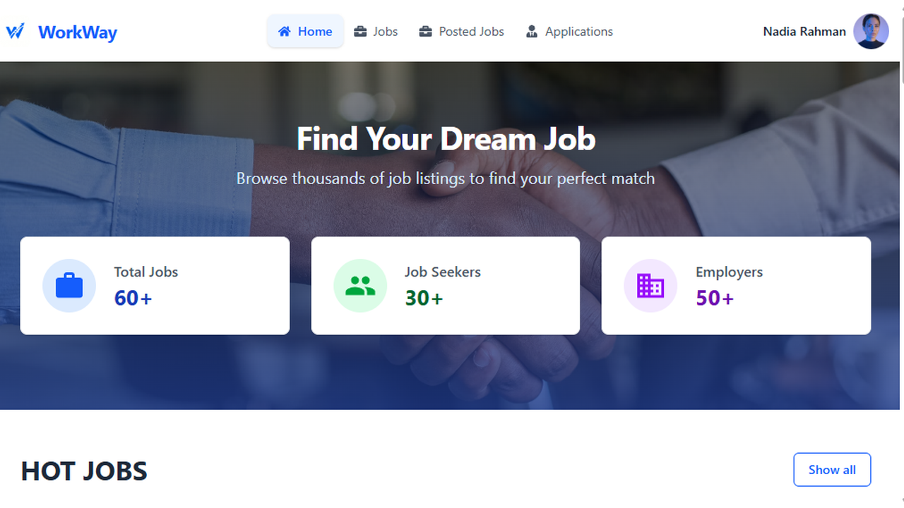
  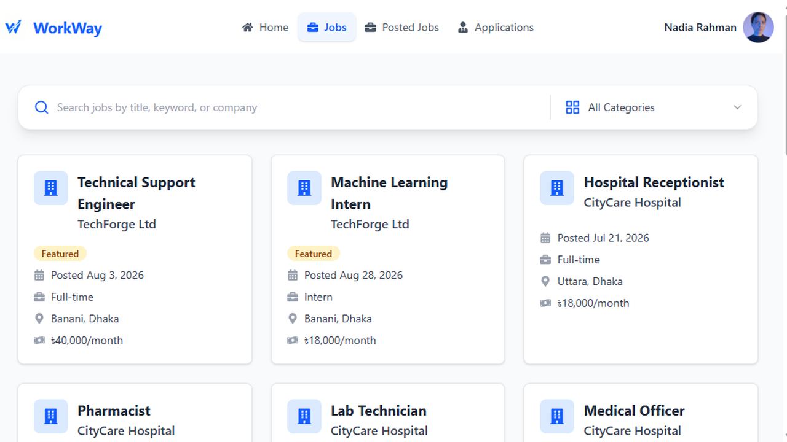
</p>
<p align="center"><em>Home · Jobs browse</em></p>

<p align="center">
  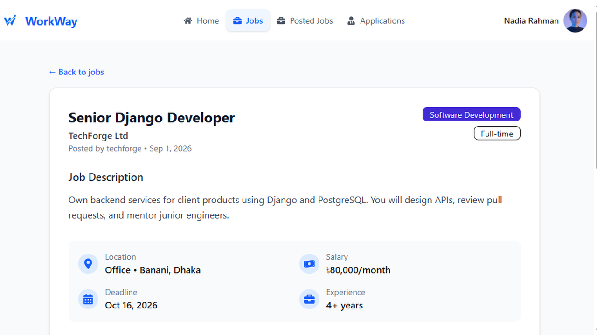
  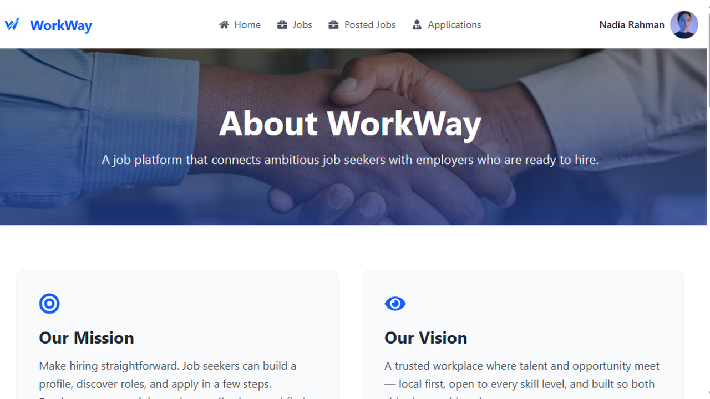
</p>
<p align="center"><em>Job details · About</em></p>

<p align="center">
  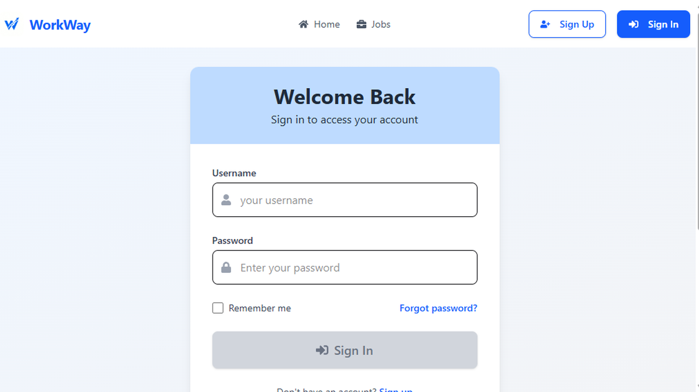
  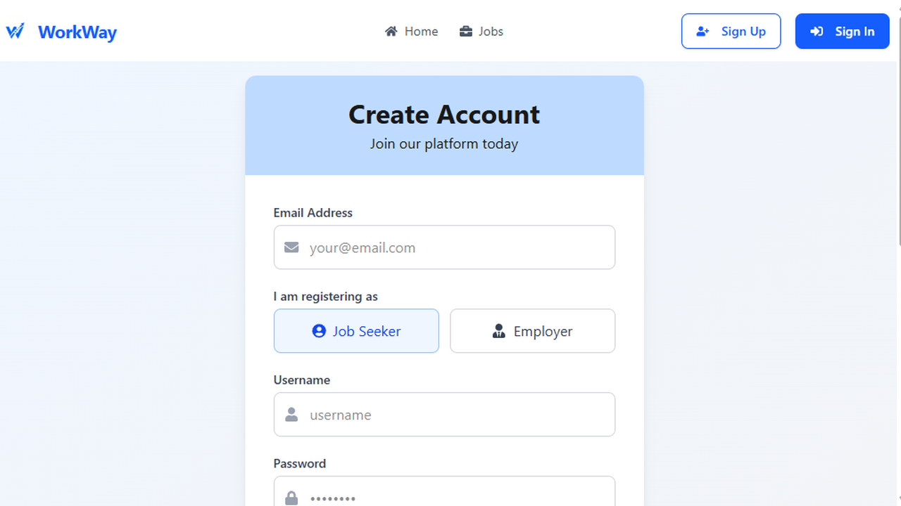
</p>
<p align="center"><em>Sign in · Sign up</em></p>

<p align="center">
  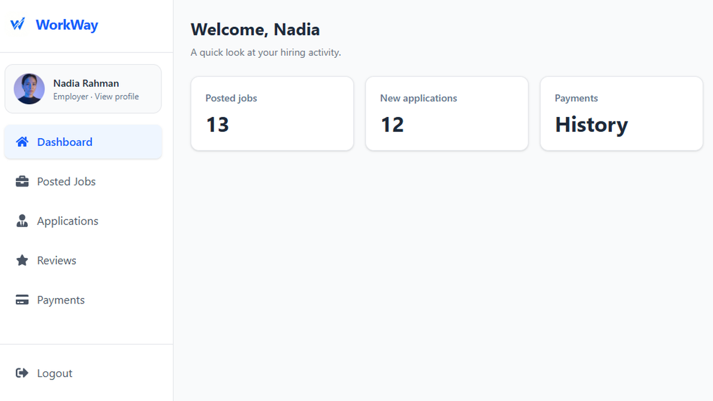
  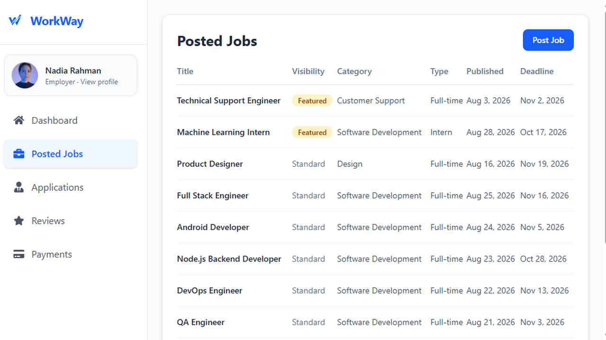
</p>
<p align="center"><em>Employer dashboard · Posted jobs</em></p>

<p align="center">
  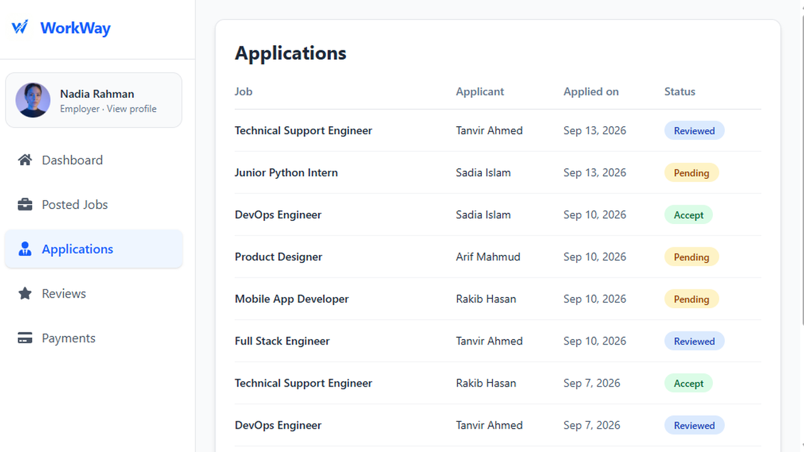
  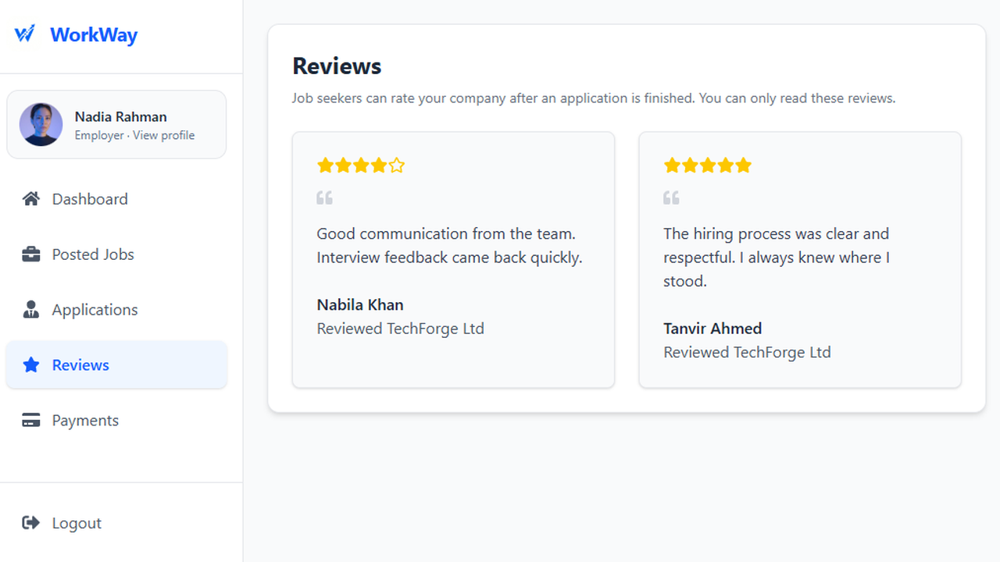
</p>
<p align="center"><em>Applications · Reviews</em></p>

<p align="center">
  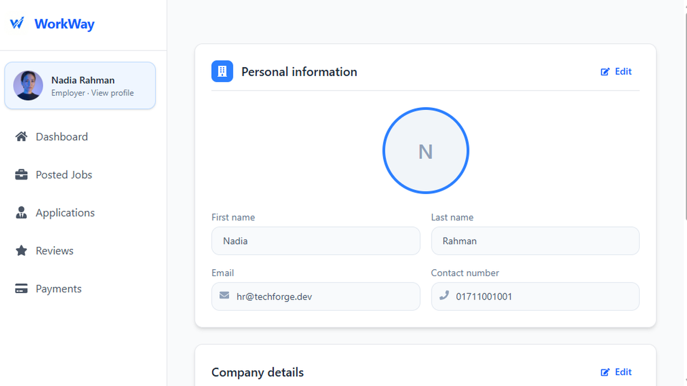
  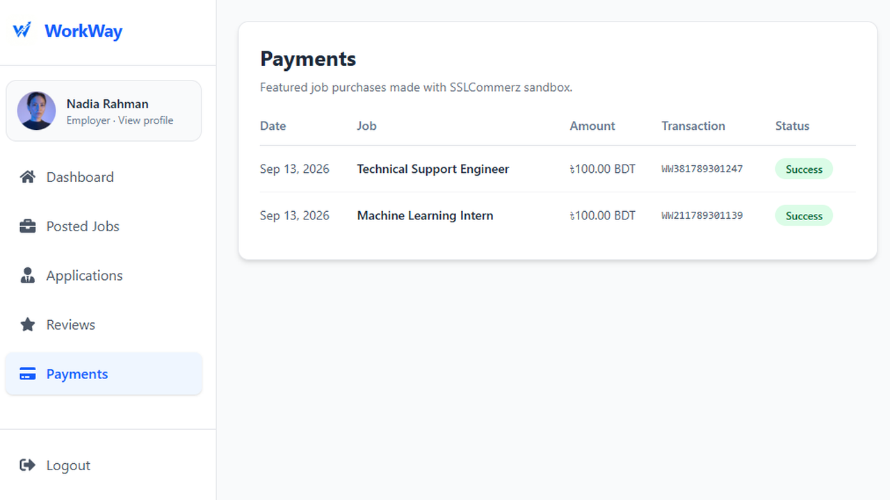
</p>
<p align="center"><em>Profile · Payments</em></p>

## 🛠️ Installation & Setup

```bash
git clone https://github.com/achibhossengit/workway-client.git
cd workway-client
npm install
```

Create a `.env` file in the project root:

```env
VITE_API_BASE_URL=http://127.0.0.1:8000/api/v1/
```

For production builds, point at the live API:

```env
VITE_API_BASE_URL=https://work-way.vercel.app/api/v1/
```

Start the Django API first (see [workway-api](https://github.com/achibhossengit/workway-api)), then:

```bash
npm run dev
```

The app runs at [http://localhost:5173](http://localhost:5173).

| Script            | Description                  |
| ----------------- | ---------------------------- |
| `npm run dev`     | Local development server     |
| `npm run build`   | Production build             |
| `npm run preview` | Preview the production build |
| `npm run lint`    | ESLint                       |

## 📁 Project Structure

```text
src/
  components/   Brand, Filter, Footer, Header, Home, Jobs, Payments, Reviews, Utilities
  context/      Auth context
  hooks/        Auth, jobs/categories, server pagination
  pages/        Home, Jobs, About, SignIn, SignUp, DashBoard, Layouts
  routes/       AppRoutes, PrivateRoutes, RoleRoute
  services/     ApiClient (Axios + JWT refresh)
public/         Static assets (logo, favicon)
docs/           README screenshots and intro banner
```

## ⚙️ Workflows

### 1. Authentication

- Register as Jobseeker or Employer → activation email → `/activate/:uid/:token`.
- Login stores access/refresh tokens in `localStorage` and loads `auth/users/me/`.
- Forgot password uses Djoser reset + `/password/reset/confirm/:uid/:token`.
- Axios attaches `Authorization: JWT <access>` and refreshes on `401`.

### 2. Job seeking

- Browse `/jobs` with filters; open `/jobs/:jobId` to apply.
- Apply requires a resume (upload on the detail page if missing).
- Cancel soft-cancels the application; re-apply reopens Pending when allowed.
- After Accept or Reject, leave a review for that employer from the dashboard.

### 3. Hiring (employers)

- Post and edit jobs from the dashboard; list applicants globally or per job.
- Update application status (Pending → Reviewed → Accept / Rejected).
- Feature a job via SSLCommerz (`payments/init/`); track history under Payments.

## 🔐 Authentication

Protected dashboard routes use `PrivateRoutes`. Employer-only paths use `RoleRoute`.

```http
Authorization: JWT <access_token>
```

## 🔌 Main Routes

### Public

| Path | Description |
| ---- | ----------- |
| `/` | Home (hot jobs, reviews, services) |
| `/jobs` | Browse & search jobs |
| `/jobs/:jobId` | Job details & apply |
| `/about-us` | About WorkWay |
| `/login` / `/register` | Sign in / sign up |
| `/activate/:uid/:token` | Email activation |
| `/password/reset/confirm/:uid/:token` | Password reset |

### Dashboard (authenticated)

| Path | Role | Description |
| ---- | ---- | ----------- |
| `/dashboard` | both | Role-based summary |
| `/dashboard/profile` | both | Profile settings |
| `/dashboard/applications` | both | My apps / all applicants |
| `/dashboard/reviews` | both | Read or write reviews |
| `/dashboard/posted-jobs` | Employer | Posted jobs |
| `/dashboard/posted-jobs/:jobId` | Employer | Job detail & manage |
| `/dashboard/post-job/:jobId` | Employer | Edit job |
| `/dashboard/payments` | Employer | Payment history |
| `/dashboard/payments/success\|fail\|cancel` | Employer | Payment result |

## 🌐 Deployment

The client is deployed on **Vercel**.

1. Push this repo to GitHub and import it in Vercel (Framework Preset: **Vite**).
2. Set environment variable:
   - `VITE_API_BASE_URL=https://work-way.vercel.app/api/v1/`
3. Deploy. Output directory is `dist` (Vite default). `vercel.json` rewrites every path to `index.html` so React Router URLs (`/jobs`, `/dashboard/...`, payment callbacks) work on refresh and external redirects. After the project is linked, Vercel redeploys automatically on each GitHub commit.
4. Confirm the live app: https://workway-client.vercel.app/
5. On the API, allow this origin in `CORS_ALLOWED_ORIGINS` and set `EMAIL_FRONTEND_DOMAIN` / `SSL_FRONTEND_URL` to the client domain.

Rebuild after changing any `VITE_*` variable — Vite embeds them at build time.
